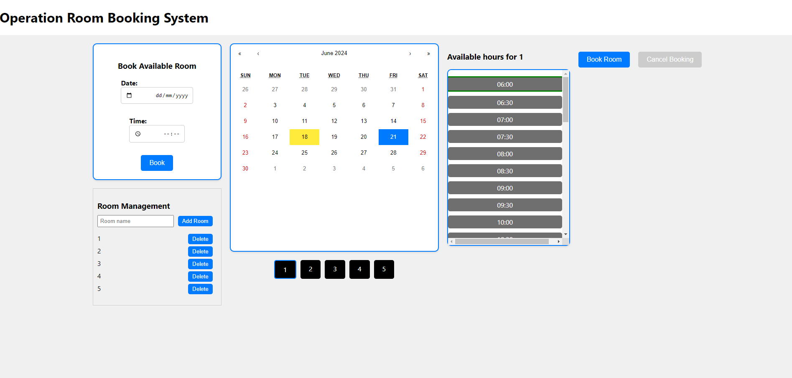

# Operation Room Booking System

This project is an Operation Room Booking System. It includes both backend (Django) and frontend (React) components.

## Functionalities

1. **View Available Rooms**: Users can see a list of available rooms.
2. **View Room Schedule**: Users can click on a room to see its schedule for a selected date.
3. **Book a Specific Room**: Users can book a room for a specific date and time. 
4. **Book a Random Room**: User can also book a random available room for a specific date and time (In the left conor)
5. **Cancel Booking**: Users can cancel an existing booking.
6. **Add Room**: User can add new rooms to the system.
7. **Delete Room**: User can delete existing rooms from the system.

Image of the website is attached at the bottom

## Prerequisites

- Python 3.8+
- Node.js
- npm (Node Package Manager)

## Setup Instructions

### 1. Clone the Project

To clone the repository, run the following command in your terminal:

```bash
git clone https://github.com/MIKIHERSHCOVITZ/operation-room-booking.git
```

### 2. Start Backend Setup

Open your IDE and navigate to the backend directory

```bash
cd operation-room-booking/backend
```

### 3. Create and Activate Virtual Environment

To create virtual environment please run the following commands:

```bash
python -m venv venv
```

Then to activate it:

On Windows
```bash
.\venv\Scripts\activate
```

On macOS/Linux

```bash
source venv/bin/activate
```

### 4. Install Dependencies

```bash
pip install -r requirements.txt
```

### 5. Database Setup

If the database is already set up, you can skip the migration commands.

```bash
python manage.py makemigrations
python manage.py migrate
```

### 6. Run the Server

Start the Django development server.

```bash
python manage.py runserver
```

When you run the server it would automatically create 5 rooms (1 to 5).

If it doesn't you can do it by running the next command:

```bash
python manage.py seed_rooms 
```

### 7. Start Frontend Setup

Open a **new** terminal and Navigate to the frontend directory

```bash
cd ../frontend
```

### 8. Start Frontend Setup

Install the required npm packages

```bash
npm install
```

### 9. Run the Frontend Server

Start the React development server

```bash
npm start
```

### 10. Running Unit Tests

To run the unit tests for the backend, make sure you are in the backend directory
and the virtual environment is activated, then run:

```bash
python manage.py test
```

### 11. Additional Information

The backend runs on http://127.0.0.1:8000/ by default. 

The frontend runs on http://127.0.0.1:3000/ by default.


### 12. Website image



